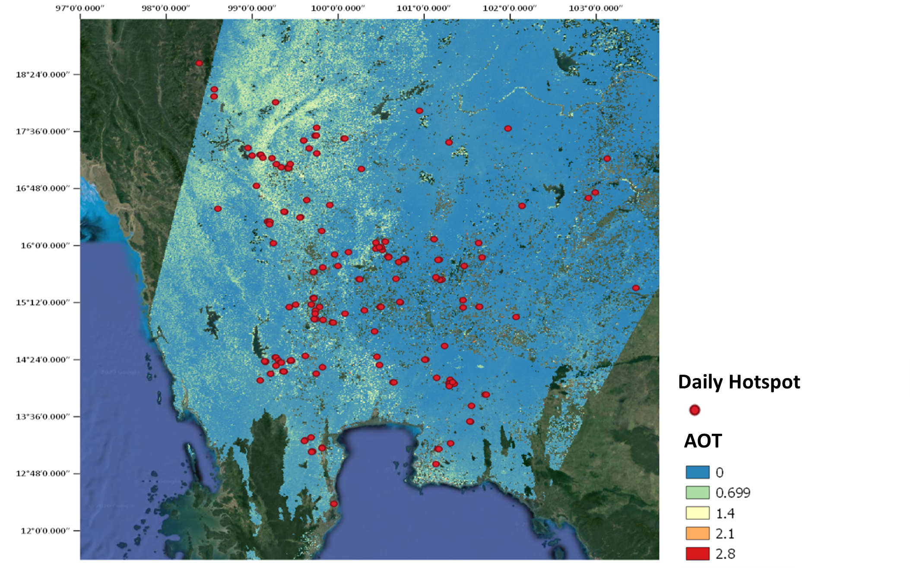

# GCOM-C-Satellite-Image-Analysis
Process and Visualize Aerosol Optical Thickness Data from GCOM-C Satellite.

Survey of open burning around Bangkok using satellite images analysis

1. GCOM-C aerosol products

GCOM-C conducts long-term and continuous global observation and data collection to contribute to surface and atmospheric measurements related to the climate change with emphasis on the carbon cycle and the radiation budget. Aerosol optical thickness is one its product to identify the atmospheric changes in terms of aerosols.
Aerosol Optical Depth (AOD) is the measure of aerosols (e.g., urban haze, smoke particles, desert dust, sea salt) distributed within a column of air from the instrument (Earth's surface) to the top of the atmosphere. GCOM C Aerosol optical thickness product (polarized observation and non-polarized observation) comes in L2 and L3(statistics) levels. Level 2 aerosol by polarization (ARPL) products were used here for the visualization. 

GCOM-C Aerosol data products

Detected hot spot and aerosol optical thickness over Thailand on 2020-01-08

Variation of hots spot and PM 2.5 value with the time - Bangkok
