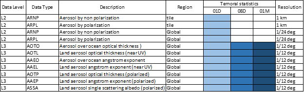

# GCOM-C-Satellite-Image-Analysis
In this study, GOCM-C aerosol data processing has been done to visualize Aerosol Optical Thickness (AOT) in a GIS platform for further processing.

1. GCOM-C aerosol products

GCOM-C conducts long-term and continuous global observation and data collection to contribute to surface and atmospheric measurements related to the climate change with emphasis on the carbon cycle and the radiation budget. Aerosol optical thickness is one its product to identify the atmospheric changes in terms of aerosols.
Aerosol Optical Depth (AOD) is the measure of aerosols (e.g., urban haze, smoke particles, desert dust, sea salt) distributed within a column of air from the instrument (Earth's surface) to the top of the atmosphere. GCOM C Aerosol optical thickness product (polarized observation and non-polarized observation) comes in L2 and L3(statistics) levels. Level 2 aerosol by polarization (ARPL) products were used here for the visualization. 

GCOM-C Aerosol data products

Hot spot data and the AOT data overlayed and tested the data's initial relation by visualizing it in the same platform. 

Detected hot spot and aerosol optical thickness over Thailand on 2020-01-08

Overview_report includes the additional work carried out to 
* Visualize the PM 2.5 level variation in Bangkok from 2018 to 2020 March 
* Interpretation of daily average PM 2.5 values in bangkok from 2018 to 2019.
* Variation of hots spot and PM 2.5 values over Bangkok to see the impact of burning of open land around Bangkok for aerosol thickness in the same region. 

Special credits: https://github.com/worasom/aqi_thailand
According to the study's timeline interest, some of the scripts were modified from the above repository to get the result for this study.

Variation of hots spot and PM 2.5 value with the time - Bangkok
